# LLM Flashcards

Visual flashcards on how LLMs work.

## The cards

<table>
  <tr>
    <td width="33%">
<b>Transformer architecture</b>
</td>
    <td width="33%">
<b>Tokenization</b>
</td>
    <td width="33%">
<b>Embeddings</b>
</td>
  </tr>
  <tr>
    <td>
<b>Training</b>
</td>
    <td>
<b>Fine-tuning</b>
</td>
    <td>
<b>RLHF and alignment</b>
</td>
  </tr>
  <tr>
    <td>
<b>Prompting</b>
</td>
    <td>
<b>Retrieval (RAG)</b>
</td>
    <td>
<b>Agents and tools</b>
</td>
  </tr>
  <tr>
    <td>
<b>Inference</b>
</td>
    <td>
<b>Scaling laws</b>
</td>
    <td>
<b>Architectures</b>
</td>
  </tr>
  <tr>
    <td>
<b>Quantization</b>
</td>
    <td>
<b>Evaluation</b>
</td>
    <td>
<b>Context management</b>
</td>
  </tr>
  <tr>
    <td>
<b>Safety and ethics</b>
</td>
    <td>
<b>APIs and practical</b>
</td>
    <td>
<b>Multimodal</b>
</td>
  </tr>
  <tr>
    <td>
<b>Reasoning</b>
</td>
    <td><a href="cards/20-reasoning-models.jpg">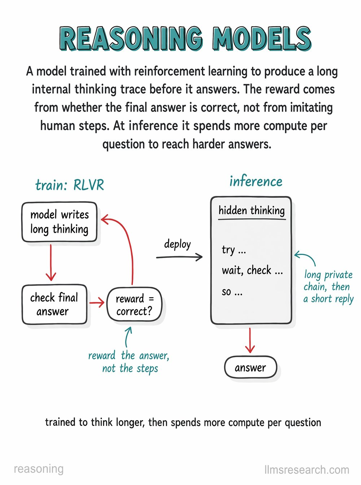</a>
<b>Reasoning models</b>
</td>
    <td><a href="cards/21-state-space-models-mamba.jpg">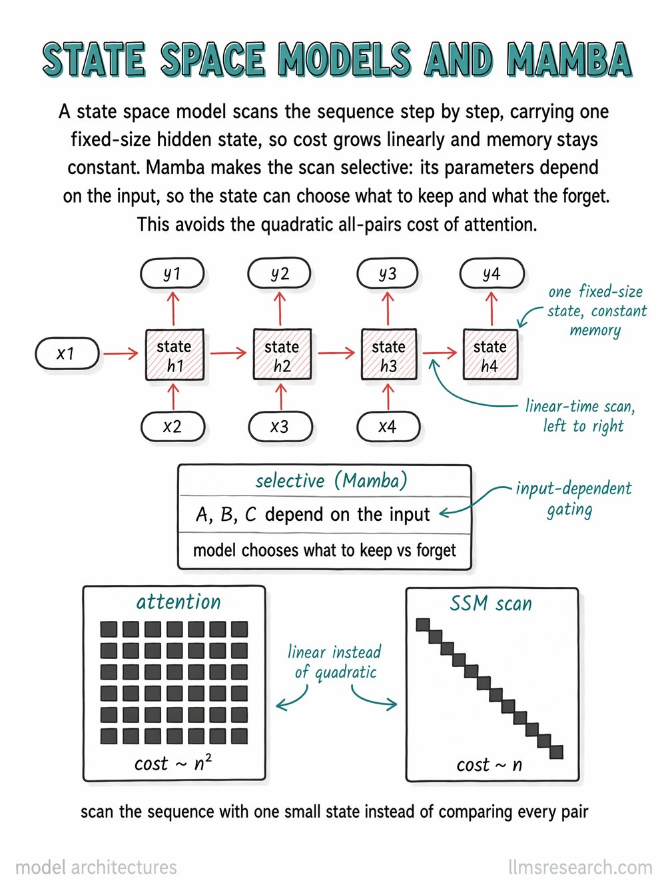</a>
<b>Architectures</b>
</td>
  </tr>
  <tr>
    <td><a href="cards/22-mixture-of-experts-routing.jpg">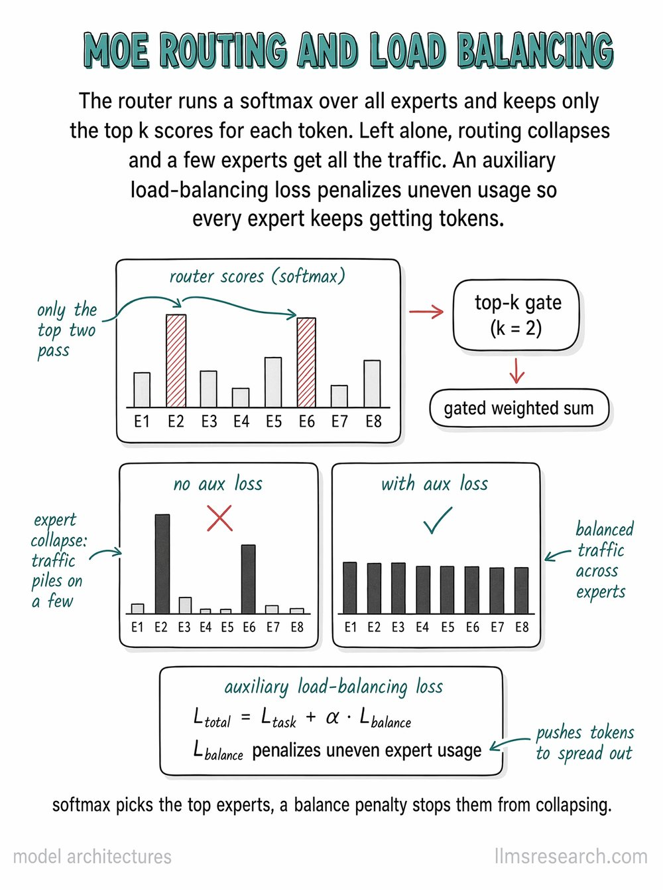</a>
<b>Architectures</b>
</td>
    <td><a href="cards/23-model-context-protocol.jpg">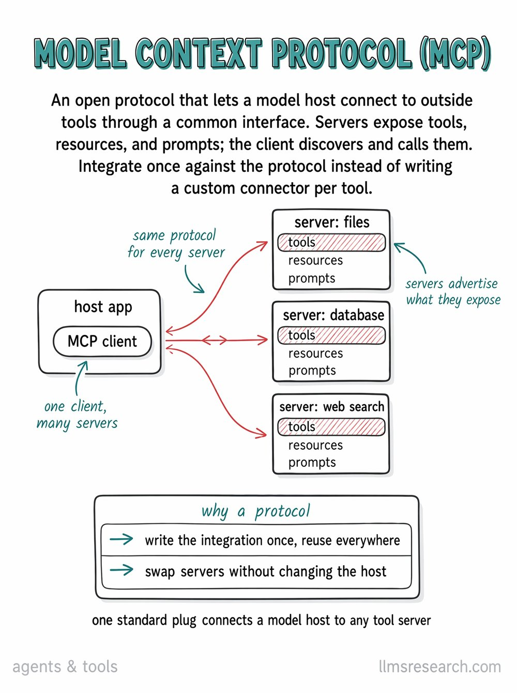</a>
<b>Agents and tools</b>
</td>
    <td><a href="cards/24-vision-transformer.jpg">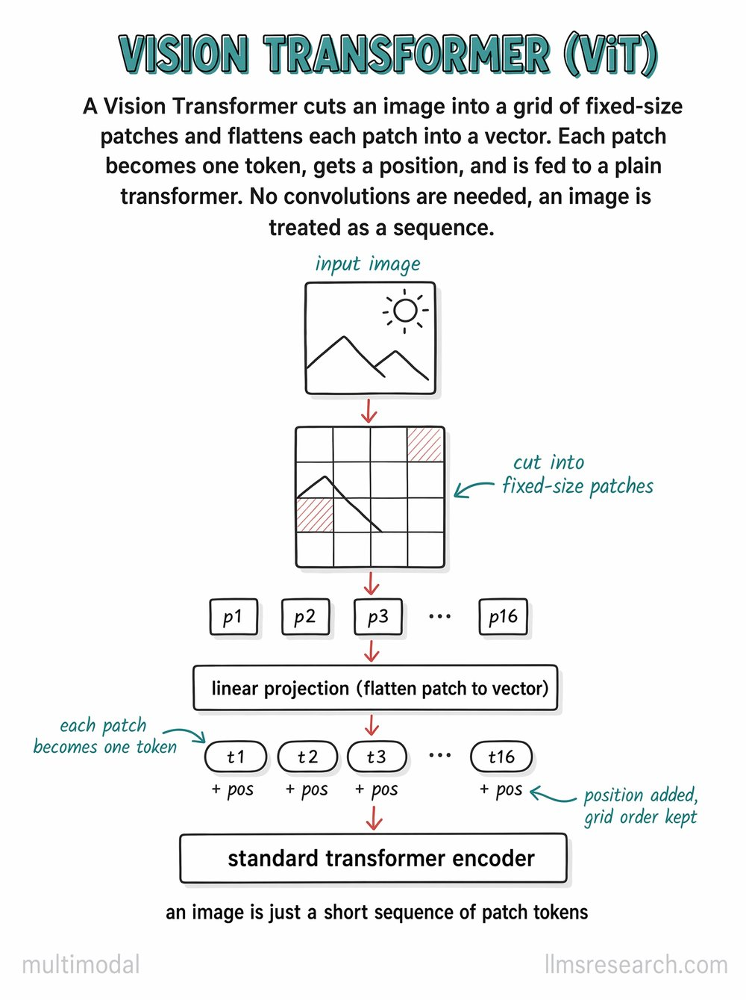</a>
<b>Multimodal</b>
</td>
  </tr>
  <tr>
    <td><a href="cards/25-sparse-autoencoders.jpg">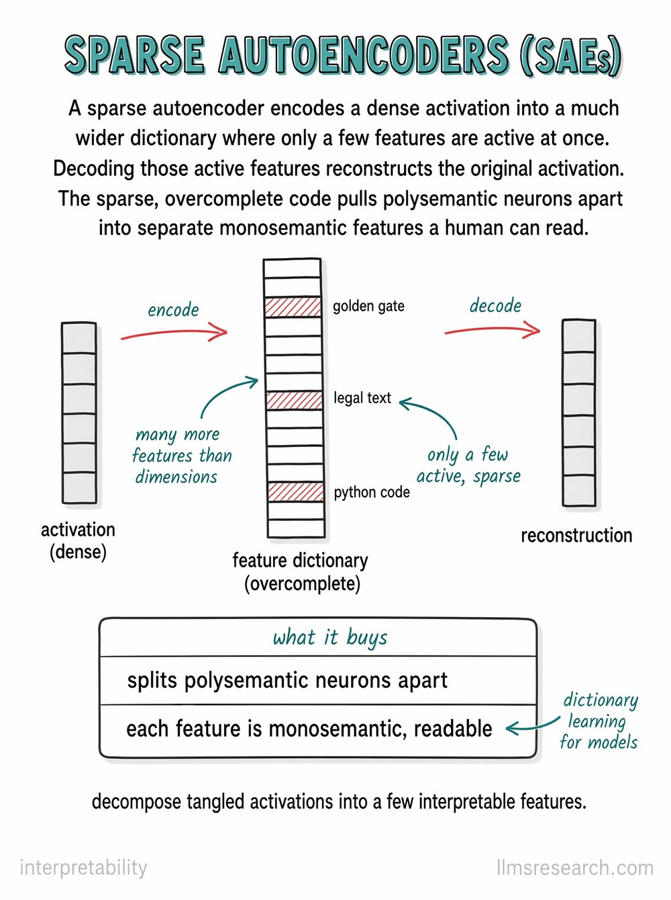</a>
<b>Interpretability</b>
</td>
    <td><a href="cards/26-tree-of-thoughts.jpg">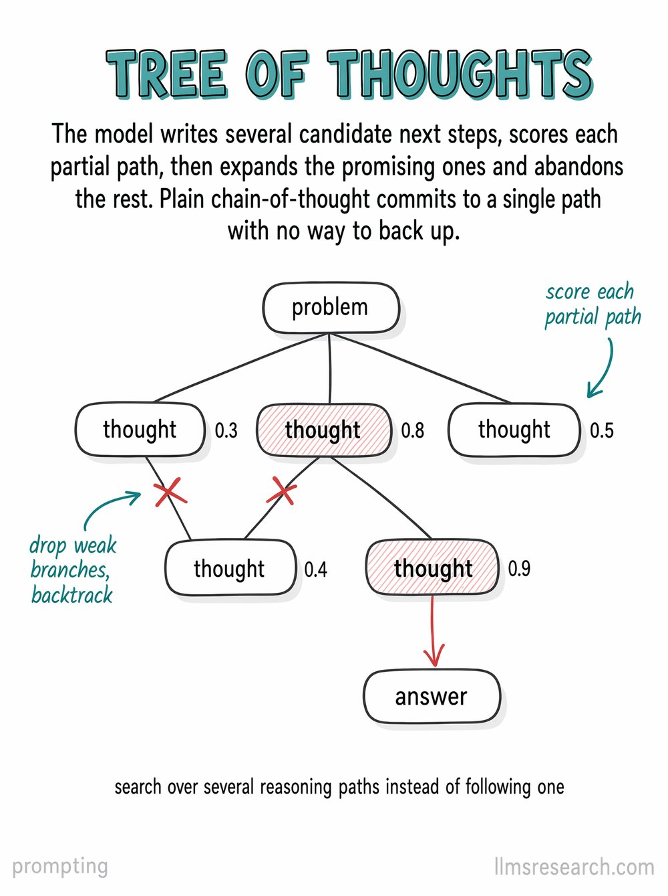</a>
<b>Prompting</b>
</td>
    <td><a href="cards/27-double-descent.jpg">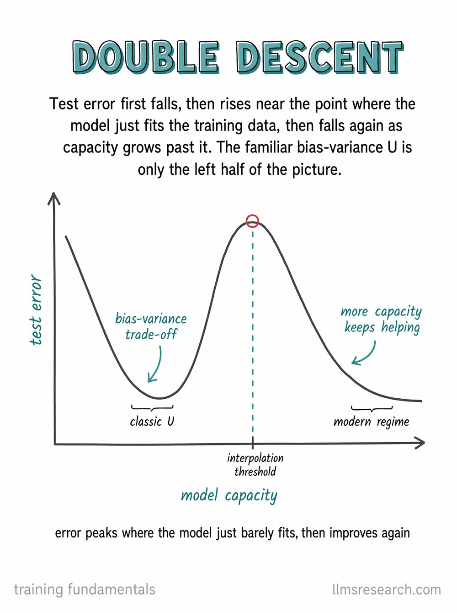</a>
<b>Training</b>
</td>
  </tr>
  <tr>
    <td><a href="cards/28-activation-functions.jpg">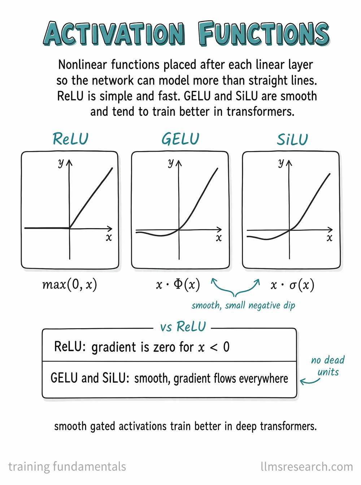</a>
<b>Training</b>
</td>
    <td><a href="cards/29-gpqa.jpg">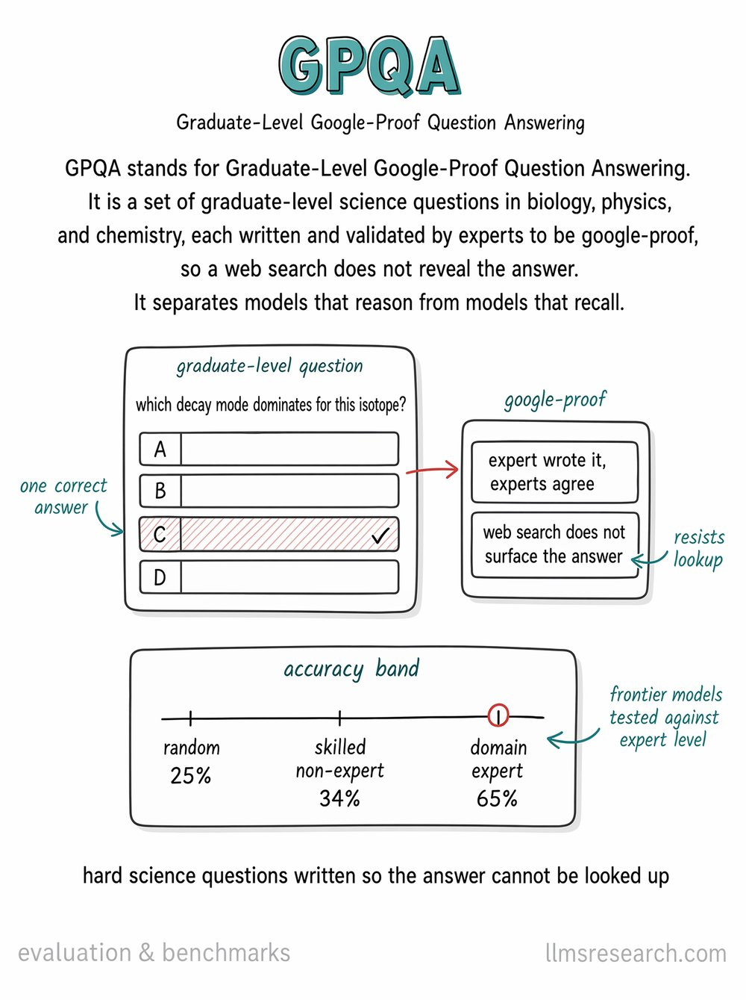</a>
<b>Evaluation</b>
</td>
    <td><a href="cards/30-matryoshka-embeddings.jpg">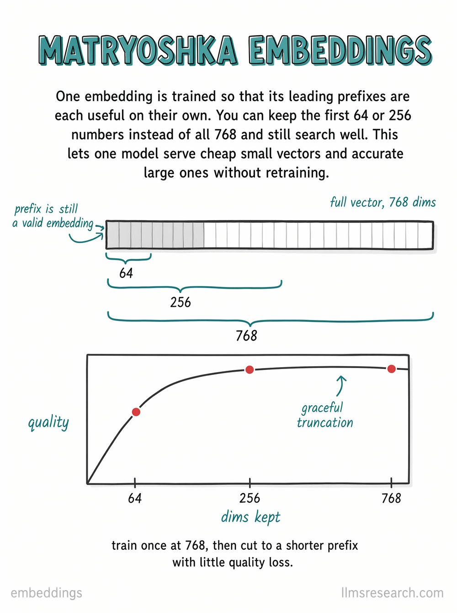</a>
<b>Embeddings</b>
</td>
  </tr>
</table>

Click any card to open it full size.

**Study in Anki:** download [`llm-flashcards.apkg`](llm-flashcards.apkg) (these 30 cards) and import it into [Anki](https://apps.ankiweb.net/). Front is the concept, back is the card.

## Why I made them

I work on LLM efficiency at LLMs Research, and a lot of that work happens on a whiteboard. Drawing a thing forces you to know what you're drawing. A vague hand-wave on a slide hides confusion. A diagram doesn't.

After enough whiteboards I had a stack of diagrams. The stack turned into a study set for myself. I tightened the lines, kept the labels honest, and put them on cards. That's the set.

The cards are for someone who has used an LLM API and wants the layer underneath. Some technical background helps. No heavy math.

## What's in the full set

332 cards across 22 topics:

| | | |
|---|---|---|
| Tokenization (12) | Embeddings and retrieval (14) | Transformer architecture (30) |
| Architecture variants (16) | Training (18) | Distributed training (10) |
| Scaling laws (10) | Fine-tuning (15) | RLHF and alignment (19) |
| Inference and decoding (19) | Quantization (12) | Prompting (19) |
| Reasoning (15) | Context management (10) | RAG (24) |
| Agents and tools (22) | Multimodal (8) | Advanced concepts (6) |
| Evaluation (16) | Safety (17) | Interpretability (7) |
| APIs and practical use (13) | | |

Three formats: a PDF (332 pages, printable), an `.apkg` for Anki spaced-repetition review, and every card as a separate image. New cards get added regularly, and past buyers get every update free.

[llmsresearch.com/flashcards](https://llmsresearch.com/flashcards?utm_source=github&utm_medium=repo&utm_campaign=flashcards_launch)

## License

CC BY-NC-ND 4.0. Share the cards with credit and a link back to this repo. No repackaging, no reselling, no modified versions, no commercial use. Full text in [LICENSE](LICENSE).

## Contributing

If something on a card is wrong or unclear, [open an issue](../../issues/new). If you want a card on a concept that is not in the set yet, open one too. I read them.

## About

[LLMs Research](https://llmsresearch.com) is an independent applied research lab. We work on LLM efficiency: inference, KV cache compression, adaptive compute, multi-agent systems. The set started as study notes for that work.

[Website](https://llmsresearch.com) · [Newsletter](https://llmsresearch.substack.com) · [X](https://x.com/llmsresearch) · [LinkedIn](https://www.linkedin.com/company/llmsresearch)
