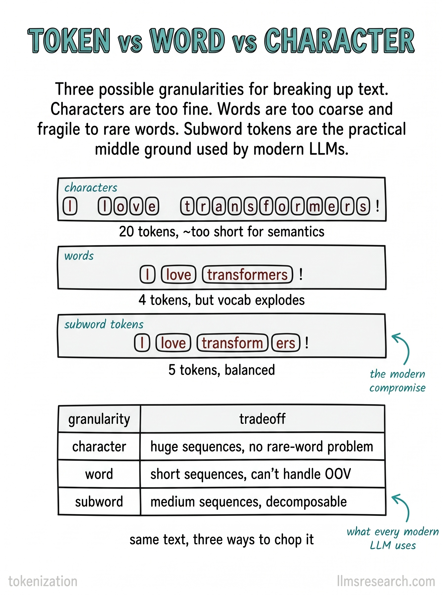
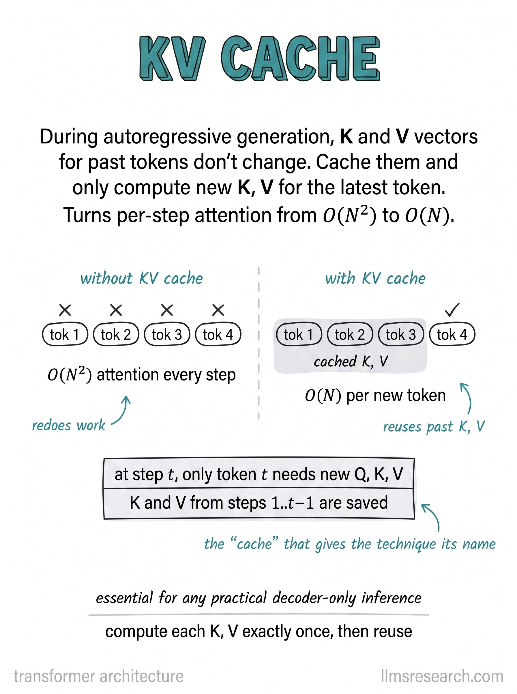
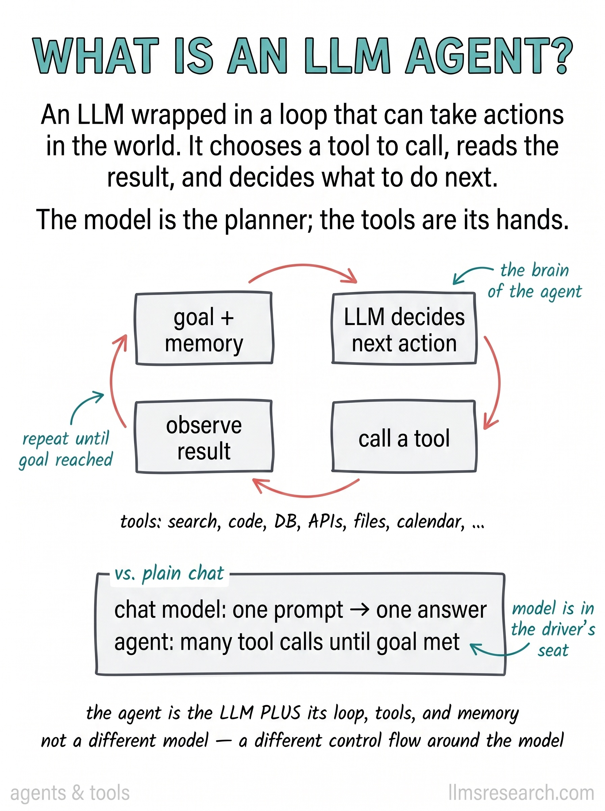

# 211 free LLM flashcards

One concept per card, with a diagram and an explanation. Use them to prepare for
an interview, revisit something you learned, or understand a system you are building.

**[Browse all 211 free cards](https://llmsresearch.com/cards?utm_source=github&utm_medium=referral&utm_campaign=visual_library&utm_content=flashcards-readme-top)**
\| [Choose a study path](#study-paths)

Click a card to open its full-size image and explanation.

<table>
  <tr>
    <td width="33%" align="center" valign="top">
      <a href="https://llmsresearch.com/cards/token-vs-word-vs-character?utm_source=github&amp;utm_medium=referral&amp;utm_campaign=visual_library&amp;utm_content=flashcards-readme-preview-token-vs-word-vs-character">
        
      </a>
      <br /><strong>Token vs Word vs Character</strong>
    </td>
    <td width="33%" align="center" valign="top">
      <a href="https://llmsresearch.com/cards/kv-cache?utm_source=github&amp;utm_medium=referral&amp;utm_campaign=visual_library&amp;utm_content=flashcards-readme-preview-kv-cache">
        
      </a>
      <br /><strong>KV Cache</strong>
    </td>
    <td width="33%" align="center" valign="top">
      <a href="https://llmsresearch.com/cards/what-is-an-llm-agent?utm_source=github&amp;utm_medium=referral&amp;utm_campaign=visual_library&amp;utm_content=flashcards-readme-preview-what-is-an-llm-agent">
        
      </a>
      <br /><strong>What is an LLM Agent?</strong>
    </td>
  </tr>
</table>

## Study paths

Read each row from left to right, or start with the concept you need.

| Start here | Read in order |
| --- | --- |
| **Attention** | [Query, key, value](https://llmsresearch.com/cards/query-key-value-vectors?utm_source=github&utm_medium=referral&utm_campaign=visual_library&utm_content=flashcards-readme-path-attention-qkv) → [Self-attention](https://llmsresearch.com/cards/self-attention-mechanism?utm_source=github&utm_medium=referral&utm_campaign=visual_library&utm_content=flashcards-readme-path-attention-self-attention) → [Multi-head attention](https://llmsresearch.com/cards/multi-head-attention?utm_source=github&utm_medium=referral&utm_campaign=visual_library&utm_content=flashcards-readme-path-attention-multi-head) → [KV cache](https://llmsresearch.com/cards/kv-cache?utm_source=github&utm_medium=referral&utm_campaign=visual_library&utm_content=flashcards-readme-path-attention-kv-cache) |
| **RAG** | [What is RAG?](https://llmsresearch.com/cards/what-is-rag?utm_source=github&utm_medium=referral&utm_campaign=visual_library&utm_content=flashcards-readme-path-rag-overview) → [Embeddings for retrieval](https://llmsresearch.com/cards/embedding-for-retrieval?utm_source=github&utm_medium=referral&utm_campaign=visual_library&utm_content=flashcards-readme-path-rag-embeddings) → [Chunking](https://llmsresearch.com/cards/chunking?utm_source=github&utm_medium=referral&utm_campaign=visual_library&utm_content=flashcards-readme-path-rag-chunking) → [Reranking](https://llmsresearch.com/cards/reranking?utm_source=github&utm_medium=referral&utm_campaign=visual_library&utm_content=flashcards-readme-path-rag-reranking) |
| **Inference** | [Autoregressive generation](https://llmsresearch.com/cards/autoregressive-generation?utm_source=github&utm_medium=referral&utm_campaign=visual_library&utm_content=flashcards-readme-path-inference-generation) → [KV cache](https://llmsresearch.com/cards/kv-cache?utm_source=github&utm_medium=referral&utm_campaign=visual_library&utm_content=flashcards-readme-path-inference-kv-cache) → [Grouped-query attention](https://llmsresearch.com/cards/grouped-query-attention?utm_source=github&utm_medium=referral&utm_campaign=visual_library&utm_content=flashcards-readme-path-inference-gqa) → [Quantization](https://llmsresearch.com/cards/what-is-quantization?utm_source=github&utm_medium=referral&utm_campaign=visual_library&utm_content=flashcards-readme-path-inference-quantization) |
| **Agents** | [What is an LLM agent?](https://llmsresearch.com/cards/what-is-an-llm-agent?utm_source=github&utm_medium=referral&utm_campaign=visual_library&utm_content=flashcards-readme-path-agents-overview) → [The agent loop](https://llmsresearch.com/cards/agent-loop?utm_source=github&utm_medium=referral&utm_campaign=visual_library&utm_content=flashcards-readme-path-agents-loop) → [Tool use](https://llmsresearch.com/cards/tool-use-function-calling?utm_source=github&utm_medium=referral&utm_campaign=visual_library&utm_content=flashcards-readme-path-agents-tools) → [Stopping conditions](https://llmsresearch.com/cards/stopping-conditions?utm_source=github&utm_medium=referral&utm_campaign=visual_library&utm_content=flashcards-readme-path-agents-stopping) |

New to LLMs? [Start with tokenization](https://llmsresearch.com/cards/what-is-tokenization?utm_source=github&utm_medium=referral&utm_campaign=visual_library&utm_content=flashcards-readme-beginner)
and follow the reader's next-card links through the collection.

## Free cards and the complete collection

- **Free online:** all 211 public cards, with explanations and related concepts.
- **Free Anki sample:** [download 30 cards](llm-flashcards.apkg). This is a separate sample, not the full public library or paid deck.
- **Complete collection:** [376 cards](https://llmsresearch.com/flashcards?utm_source=github&utm_medium=referral&utm_campaign=visual_library&utm_content=flashcards-readme-complete), including the full Anki deck, printable PDF, individual images, and lifetime updates.

## What Is Inside

The visual cards are organized around the main layers of modern LLM systems:

- Representing language: tokenization and embeddings
- The transformer: attention, normalization, position encodings, and model variants
- Training: objectives, losses, optimizers, scaling laws, and fine-tuning
- Adaptation and alignment: SFT, RLHF, DPO, preference data, and guardrails
- Running the model: decoding, inference latency, KV cache, and quantization
- Talking to the model: prompting, reasoning, and context management
- Knowledge and tools: retrieval, RAG, agents, and function calling
- Beyond text: multimodal models and CLIP
- Measuring: benchmarks, human evaluation, and contamination
- Governing: grounding, bias, sycophancy, memorization, and safety behavior
- Shipping: APIs, streaming, costs, rate limits, and latency optimization

## Run Locally

Install dependencies.

```bash
npm install
```

Start the development server.

```bash
npm run dev
```

Build the static site.

```bash
npm run build
```

Preview the production build.

```bash
npm run preview
```

## Deploy

The canonical reader is `https://llmsresearch.com/cards`. This public repository
supplies its content through the main website's existing webhook and build
workflow. GitHub Pages preserves old URLs with page-specific redirects when
the migration is enabled.

Pushes to `main` run `.github/workflows/deploy.yml`, which installs dependencies,
builds the Astro site, and publishes `dist/` with GitHub Pages. In the repository
settings, set Pages to use GitHub Actions as the build and deployment source.

## Repository Layout

```text
src/content/cards/   Card explanations in MDX, one file per card
src/pages/           Astro routes for the map, card pages, and about page
src/layouts/         Shared page layout
src/styles/          Global CSS
public/cards/        Card image assets
```

Generated and local-only folders such as `node_modules/`, `dist/`, and `.astro/`
are ignored.

## Card Content

Each card has two parts:

- an image in `public/cards/`
- an MDX explanation in `src/content/cards/`

The MDX frontmatter stores the card order, title, chapter, category, summary,
image path, and related-card links. The body text explains the concept in a few
paragraphs and is rendered on the card page.

## Contributing

If a card is wrong, unclear, or missing an important nuance, open an issue with
the card title and the proposed correction. Text corrections should be small and
factual. Image changes are handled separately because the card images are licensed
under NoDerivatives terms.

## License

See [LICENSE](LICENSE). The card images are licensed under CC BY-NC-ND 4.0.
